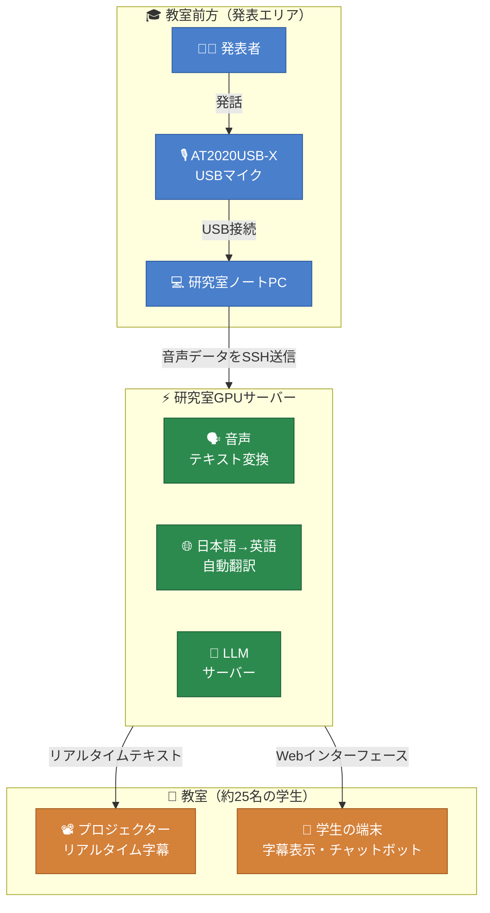

# 竹本研ゼミAIアシスタント — システム概要

### 教室での流れ

前方に設置したAT2020USB-Xマイクが発表音声を収音し、研究室ノートPCがその音声をSSH経由でGPUサーバーへ送信します。サーバー側では、音声テキスト変換・日本語英語翻訳・LLMチャットボットの3処理が並行して動きます。

結果は2つの経路で同時に届きます。リアルタイムの字幕はプロジェクターに映し出されます。また、教室内の学生25名はそれぞれのスマホやPCでWebページを開き、同じ字幕を確認しながら、チャット欄から過去の研究資料をもとにAIへ質問できます。

外部サービスへのデータ送信は一切ありません。処理はすべて大学ネットワーク内で完結し、追加費用もゼロです。
