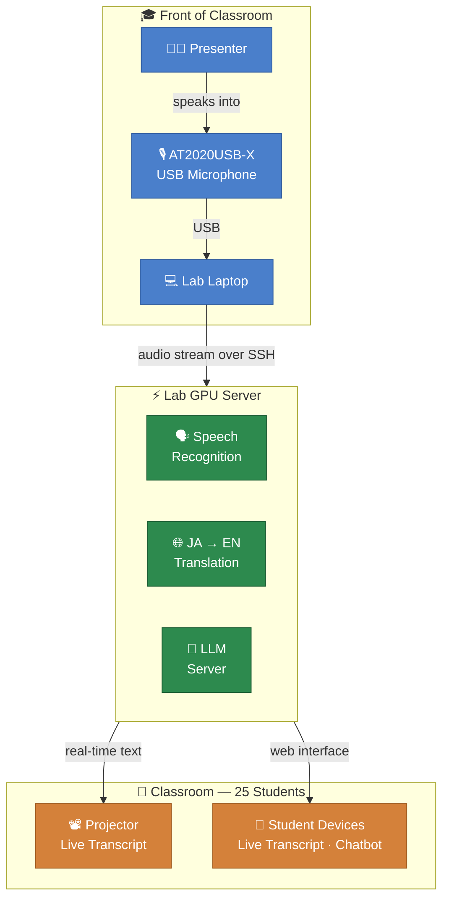

# Takemoto Lab Seminar Assistant — System Overview

### How it works in the classroom

The AT2020USB-X microphone sits at the front of the room and captures audio as students present. The Lab Laptop streams that audio over a secure SSH connection to the Lab GPU Server, which runs three components in parallel: speech recognition, a Japanese-to-English translation model, and an LLM server (Ollama with qwen2.5:14b) for the chatbot.

Results flow back out two ways at once. The live transcript appears on the classroom projector so everyone can follow along. The 25 students in the room also have access to a web page on their own phone or laptop showing the same feed, plus a chatbot panel where they can ask questions answered from past lab materials.

Nothing is sent to any external service. All processing stays within the university network, and there is no ongoing cost.
