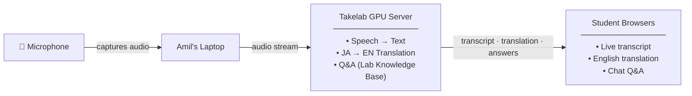

# Takemoto Lab Seminar Assistant — System Overview

| | |
|---|---|
| **Input** | USB mic on Amil's laptop captures seminar audio |
| **Processing** | Takelab GPU server — speech recognition, translation, Q&A — all within university network |
| **Output** | Students open a web page on any device to see live transcript, English translation, and ask questions |
| **Cost** | Zero — runs on existing hardware, no external APIs |
