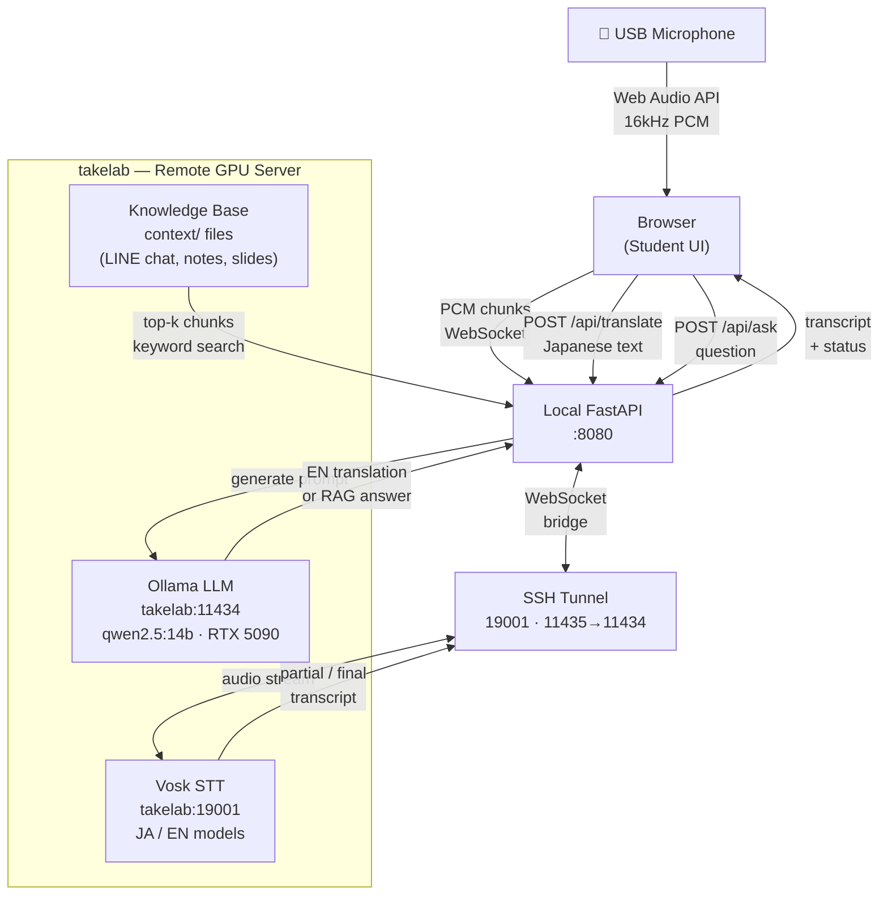

# Takemoto Lab Seminar Assistant — System Architecture

## Component Summary

| Component | Where | Technology | Purpose |
|---|---|---|---|
| Browser UI | Local | HTML/JS, Web Audio API | Mic capture, transcript + translation display, Q&A chat |
| Local App | Local | Python FastAPI | WebSocket bridge, `/api/translate`, `/api/ask` |
| RAG Indexer | Local | Python (startup) | Indexes `context/` files into searchable chunks |
| STT Service | takelab | Vosk (Python) | Real-time speech-to-text, JA + EN models |
| LLM Service | takelab | Ollama + qwen2.5:14b | JA→EN translation and RAG Q&A |
| GPU | takelab | NVIDIA RTX 5090 (32 GB) | Fast local inference — no cloud API needed |
| Transport | SSH tunnel | SSH port forward | Secure, zero-config networking |

## Key Design Decisions

- **No cloud APIs** — all AI runs on the existing takelab GPU, zero ongoing cost, no data leaves the university network.
- **Language switching** — Vosk restarts with the correct JA/EN model on selector change; auto-mode detects language from the audio stream.
- **RAG corpus** — drop files into `context/` and restart the app to re-index. No vector DB required for prototype; can upgrade to embeddings later.
- **Latency** — STT partials appear within ~600 ms. Translation adds ~1–2 s per sentence (GPU inference).
