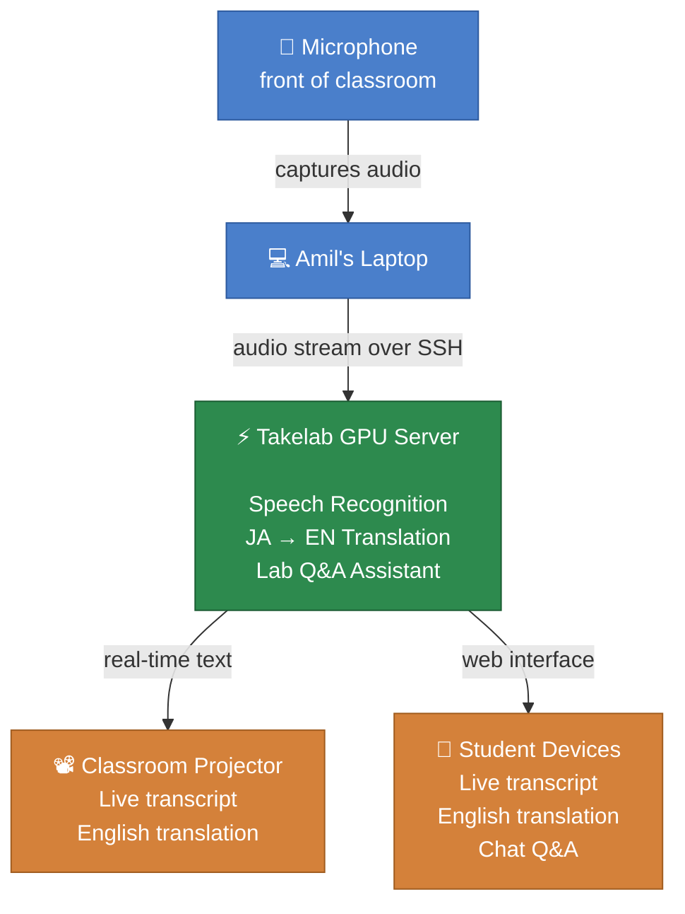

# Takemoto Lab Seminar Assistant — System Overview

### How it works in the classroom

A USB microphone at the front of the room captures audio as students present. The audio streams over a secure SSH connection to the Takelab GPU server, which handles all the heavy processing: speech-to-text, Japanese-to-English translation, and answering questions from the lab knowledge base.

The results flow back out in two directions at once. The live transcript and translation appear on the classroom projector so everyone can follow along. At the same time, the 25 or so students sitting in the room can open a web page on their own phone or laptop to see the same feed and type questions into the chat panel.

Nothing is sent to any external service. All processing stays within the university network, and there is no ongoing cost.
